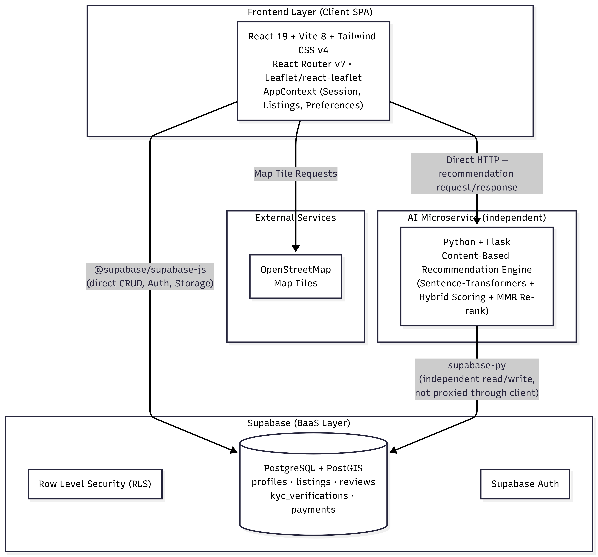

# 🏠 NestFinder

> **Map-Based Room Finder with AI-Powered Recommendation System**
> Smart Room Finding for Students and Tenants in Nepal

---

## 📌 Overview

NestFinder is a web application that helps tenants — especially students —
find rooms and flats quickly using an interactive map interface and an
AI-powered recommendation engine. Landlords can post listings, tenants can
search, filter, and receive personalized room suggestions based on their
preferences and saved-listing history, and admins moderate listings and
verify landlord KYC submissions.

---

## ✨ Features

### ⭐ Highlight Features
| Feature | Description |
|---|---|
| 🗺️ Map-Based Room Finding | Browse available rooms directly on an interactive map with nearby POIs |
| 🤖 AI Recommendation System | Get personalized room suggestions combining semantic matching, budget/location/amenity fit, and your saved-listing history |

### ✅ Core Features

- **User Authentication** — Separate signup/login for Tenants and Landlords with profile management, backed by Supabase Auth
- **Room Listing System** — Landlords can post listings with images, price, location, and facility details
- **Smart Search & Filtering** — Filter rooms by budget, location, WiFi, parking, furnishing, and more
- **Nearby Services** — View nearby colleges, hospitals, bus stops, and markets for each listing
- **Landlord KYC Verification** — Landlords submit identity/address documents for admin review before listings go live
- **Paid Radius Access** — Tenants can pay (eSewa/Fonepay proof upload) for extended search-radius access
- **Admin Dashboard** — Manage users, moderate listings, review KYC submissions, and remove fake or spam posts
- **Notifications** — In-app notifications for listing status changes, inquiries, saved rooms, and payments

---

## 🏗️ Architecture

NestFinder is two independently runnable services, not a monolith:



- **`client/`** — React + Vite frontend. Talks to Supabase directly for
  auth, listings, notifications, KYC, and payments (no custom Node/Express
  API in this repo). See [`client/README.md`](client/README.md).
- **`ai-service/`** — Flask microservice that embeds listings and tenant
  preferences with a sentence-transformer model, scores/re-ranks them, and
  returns AI-picked recommendations. The client falls back to a client-side
  rule-based ranking if this service is unreachable. See
  [`ai-service/README.md`](ai-service/README.md).
- **Supabase** — Hosted Postgres database, authentication, and file storage.
  Both services read/write to the same Supabase project.

---

## 🛠️ Tech Stack

| Layer | Technology |
|---|---|
| Frontend | React 19, Vite, React Router 7, Tailwind CSS v4, Leaflet + react-leaflet |
| Backend / Data | Supabase (Postgres, Auth, Storage) |
| AI Service | Python, Flask, Sentence Transformers (`all-MiniLM-L6-v2`), MMR re-ranking |
| Maps | Leaflet.js + OpenStreetMap (no billing required) |
| Tooling | ESLint, Prettier (`prettier-plugin-tailwindcss`) |

---

## 🚀 Getting Started

### Prerequisites

- Node.js 18+
- Python 3.12 (3.9+ likely works, untested)
- A Supabase project (URL + anon key)

### 1. Clone the repository

```bash
git clone <this-repo-url>
cd NestFinder
```

### 2. Set up the client (React frontend)

```bash
cd client
npm install
# create client/.env with VITE_SUPABASE_URL and VITE_SUPABASE_ANON_KEY
npm run dev
```

Full details: [`client/README.md`](client/README.md)

### 3. Set up the AI service (optional, for AI-ranked recommendations)

```bash
cd ai-service
python -m venv venv
venv\Scripts\Activate.ps1   # Windows PowerShell; see README for other shells
pip install -r requirements.txt
# create ai-service/.env with SUPABASE_URL and SUPABASE_ANON_KEY
python app.py
```

Full details: [`ai-service/README.md`](ai-service/README.md)

The client works without the AI service running — the "AI Recommend" flow
just falls back to rule-based scoring instead of the ML-ranked results.

---

## 🗂️ Project Structure

```
NestFinder/
├── client/            # React + Vite frontend (talks directly to Supabase)
│   ├── src/
│   │   ├── api/           # Supabase / ai-service call wrappers
│   │   ├── Context/       # Global app state (AppContext.jsx)
│   │   ├── Pages/          # Route-level views + dashboards
│   │   ├── components/     # Reusable UI components
│   │   └── utils/           # Geo, pricing, listing-lifecycle helpers
│   └── db/supabaseClient.js
├── ai-service/         # Flask AI microservice
│   └── app.py
└── README.md
```

---

## 👥 Team

The project is developed by
1. Arpan Adhikari
2. Purnima Bhattrai

---

## 📄 License

This project is for academic purposes.
